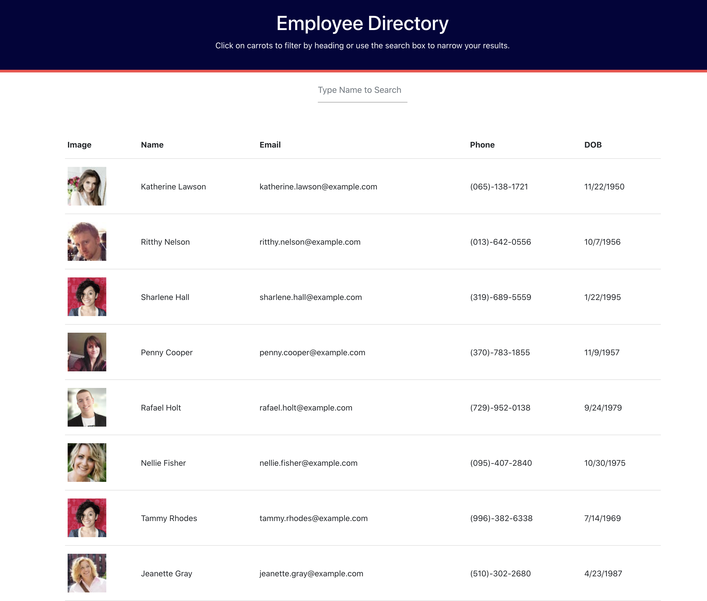

# Employee-Directory

## Description

With this simple web app, the user is able to search a user api based on the letter inputs in the search feature and switch the the order of the displayed list when the user clicks on the employee name header.

## Technologies

react

## WIP

Working on switching list order feature

## Deployed Site

https://pyeatti.github.io/Employee-Directory/

## Screengrab

